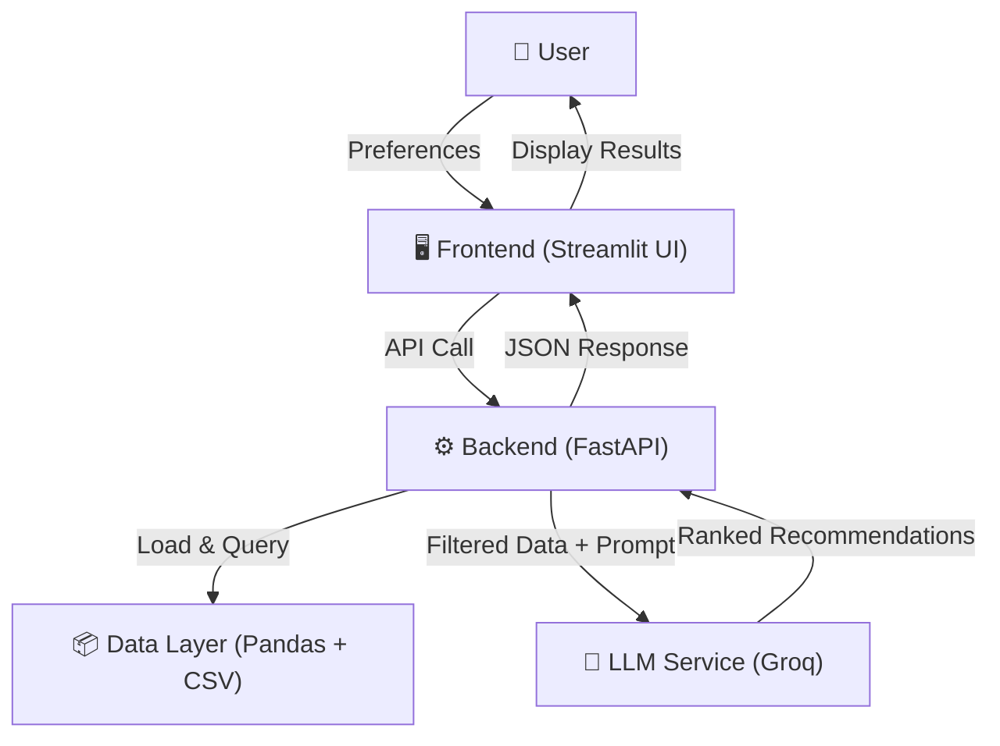
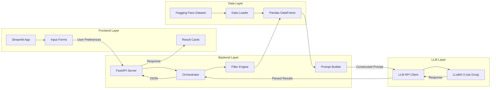
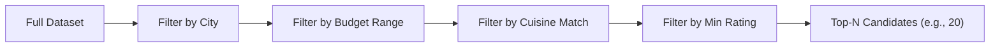
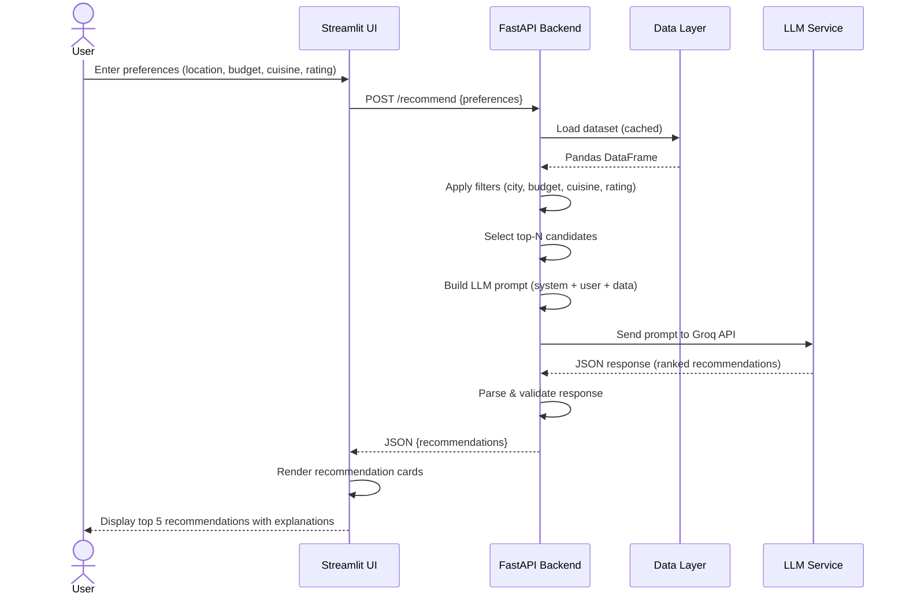

# Architecture: AI-Powered Restaurant Recommendation System

## 1. High-Level Overview

This document describes the end-to-end architecture for an AI-powered restaurant recommendation system inspired by Zomato. The system combines **structured restaurant data** with a **Large Language Model (LLM)** to deliver personalized, human-like dining recommendations.



---

## 2. Technology Stack

| Layer              | Technology                        | Purpose                                      |
| ------------------ | --------------------------------- | -------------------------------------------- |
| **Frontend**       | Streamlit                         | Interactive web UI for user input & display   |
| **Backend**        | FastAPI                           | REST API, business logic, orchestration       |
| **Data Storage**   | Pandas DataFrame + CSV/Parquet    | In-memory data processing & filtering         |
| **Dataset Source** | Hugging Face Datasets             | Zomato restaurant dataset ingestion           |
| **LLM Provider**   | Groq API (LLaMA 3)               | Natural language reasoning & ranking          |
| **Prompt Engine**  | LangChain (optional) / Raw Prompts| Prompt construction & template management     |
| **Config**         | python-dotenv                     | Environment variable & API key management     |
| **Language**       | Python 3.10+                      | Primary programming language                  |

---

## 3. System Architecture (Detailed)

### 3.1 Component Diagram



---

## 4. Module Breakdown

### 4.1 Data Ingestion Module

**Responsibility:** Load, clean, and prepare the Zomato dataset for querying.

```
data/
├── loader.py          # Fetch dataset from Hugging Face, cache locally
├── preprocessor.py    # Clean columns, normalize types, handle missing values
└── schema.py          # Define data models / column schemas
```

**Key Operations:**
- Load dataset using `datasets` library from Hugging Face
- Extract fields: `restaurant_name`, `city`, `cuisine`, `cost_for_two`, `aggregate_rating`, `votes`, `has_online_delivery`, etc.
- Normalize budget into categories (`low`, `medium`, `high`) based on `cost_for_two` percentiles
- Cache the processed DataFrame to avoid repeated downloads

**Data Schema:**

| Field                | Type    | Description                          |
| -------------------- | ------- | ------------------------------------ |
| `restaurant_name`    | string  | Name of the restaurant               |
| `city`               | string  | City / Location                      |
| `cuisines`           | string  | Comma-separated cuisine types        |
| `cost_for_two`       | float   | Average cost for two people          |
| `aggregate_rating`   | float   | Average rating (0.0 – 5.0)          |
| `votes`              | int     | Total number of votes                |
| `has_online_delivery` | bool   | Whether online delivery is available |
| `has_table_booking`  | bool    | Whether table booking is available   |

---

### 4.2 User Input Module

**Responsibility:** Collect, validate, and structure user preferences.

```
ui/
├── app.py             # Streamlit main application
├── components.py      # Reusable UI components (forms, cards, filters)
└── config.py          # UI configuration & constants
```

**Input Parameters:**

| Parameter              | Type     | Validation                              | Example                  |
| ---------------------- | -------- | --------------------------------------- | ------------------------ |
| `location`             | string   | Must match available cities in dataset  | `"Delhi"`, `"Bangalore"` |
| `budget`               | enum     | One of: `low`, `medium`, `high`         | `"medium"`               |
| `cuisine`              | string[] | One or more from available cuisines     | `["Italian", "Chinese"]` |
| `min_rating`           | float    | Range: 0.0 – 5.0                       | `3.5`                    |
| `additional_preferences` | string | Free-text (passed to LLM for reasoning) | `"family-friendly"`     |

---

### 4.3 Filter Engine

**Responsibility:** Apply structured filters to narrow down the restaurant dataset before passing to the LLM.

```
core/
├── filter.py          # Filtering logic based on user preferences
├── ranker.py          # Pre-ranking by rating/votes before LLM
└── utils.py           # Helper functions
```

**Filter Pipeline:**



**Logic:**
1. **Location Filter:** Exact match on `city` column
2. **Budget Filter:** Map budget tier to `cost_for_two` ranges:
   - `low`: ≤ 33rd percentile
   - `medium`: 33rd – 66th percentile
   - `high`: > 66th percentile
3. **Cuisine Filter:** Substring/set match on `cuisines` column
4. **Rating Filter:** `aggregate_rating >= min_rating`
5. **Cap Results:** Limit to top 15–20 candidates (sorted by rating × votes) to stay within LLM context limits

---

### 4.4 Prompt Builder

**Responsibility:** Construct a well-structured prompt for the LLM that includes user preferences and filtered restaurant data.

```
llm/
├── prompt_builder.py  # Template-based prompt construction
├── templates/         # Prompt templates (system, user, few-shot)
│   ├── system.txt
│   └── user.txt
└── parser.py          # Parse LLM response into structured output
```

**Prompt Structure:**

```
┌─────────────────────────────────────────────────┐
│  SYSTEM PROMPT                                  │
│  - Role: Expert restaurant recommender          │
│  - Instructions: Rank, explain, format output   │
│  - Output format: JSON array                    │
├─────────────────────────────────────────────────┤
│  USER PROMPT                                    │
│  - User preferences (location, budget, etc.)    │
│  - Additional preferences (free text)           │
│  - Filtered restaurant data (tabular)           │
│  - Request: "Recommend top 5 restaurants"       │
└─────────────────────────────────────────────────┘
```

**Example System Prompt:**
```
You are an expert restaurant recommendation assistant. Given a list of
restaurants and user preferences, rank the top 5 restaurants and explain
why each is a great fit. Return your response as a JSON array with fields:
rank, restaurant_name, cuisine, rating, cost_for_two, explanation.
```

---

### 4.5 LLM Service

**Responsibility:** Communicate with the LLM API, handle retries, rate limits, and parse responses.

```
llm/
├── client.py          # API client (Groq)
├── config.py          # Model selection, temperature, max_tokens
└── parser.py          # Response parsing & validation
```

**Configuration:**

| Parameter       | Default Value       | Description                       |
| --------------- | ------------------- | --------------------------------- |
| `model`         | `llama3-70b-8192`   | Model identifier                  |
| `temperature`   | `0.7`               | Creativity vs. determinism        |
| `max_tokens`    | `1024`              | Max response length               |
| `top_p`         | `0.9`               | Nucleus sampling threshold        |
| `timeout`       | `30s`               | Request timeout                   |

**Error Handling:**
- Retry with exponential backoff (max 3 retries)
- Fallback to rule-based ranking if LLM is unavailable
- Validate JSON response structure before returning

---

### 4.6 Output Display

**Responsibility:** Render LLM-generated recommendations in a clean, user-friendly format.

**Output Card Structure:**

```
┌──────────────────────────────────────────┐
│  🏆 #1  Restaurant Name                 │
│  ─────────────────────────────────────── │
│  🍕 Cuisine: Italian, Continental       │
│  ⭐ Rating: 4.5 / 5.0  (320 votes)     │
│  💰 Cost for Two: ₹800                  │
│  ─────────────────────────────────────── │
│  💡 Why this pick:                      │
│  "Great Italian food within your budget │
│   in South Delhi. Highly rated for      │
│   family dining with excellent service."│
└──────────────────────────────────────────┘
```

---

## 5. Project Directory Structure

```
ZOMATO milestone 1/
├── Docs/
│   └── problem statement.txt
├── context.md
├── architecture.md
├── requirements.txt
├── .env                        # API keys (GROQ_API_KEY)
├── .gitignore
│
├── data/
│   ├── loader.py               # Dataset loading from Hugging Face
│   ├── preprocessor.py         # Data cleaning & normalization
│   └── schema.py               # Data models & column definitions
│
├── core/
│   ├── filter.py               # Structured filtering engine
│   ├── ranker.py               # Pre-ranking logic
│   └── utils.py                # Shared helper functions
│
├── llm/
│   ├── client.py               # LLM API client (Groq)
│   ├── prompt_builder.py       # Prompt construction
│   ├── parser.py               # Response parsing & validation
│   ├── config.py               # LLM configuration
│   └── templates/
│       ├── system.txt          # System prompt template
│       └── user.txt            # User prompt template
│
├── ui/
│   ├── app.py                  # Streamlit main application
│   ├── components.py           # UI components (cards, forms)
│   └── config.py               # UI constants & settings
│
└── tests/
    ├── test_filter.py          # Unit tests for filter engine
    ├── test_prompt.py          # Unit tests for prompt builder
    └── test_parser.py          # Unit tests for response parser
```

---

## 6. Data Flow (Sequence Diagram)



---

## 7. API Design

### `POST /recommend`

**Request Body:**
```json
{
  "location": "Delhi",
  "budget": "medium",
  "cuisines": ["Italian", "Chinese"],
  "min_rating": 3.5,
  "additional_preferences": "family-friendly, good ambiance"
}
```

**Response Body:**
```json
{
  "status": "success",
  "count": 5,
  "recommendations": [
    {
      "rank": 1,
      "restaurant_name": "Olive Bar & Kitchen",
      "cuisines": "Italian, Continental",
      "aggregate_rating": 4.5,
      "cost_for_two": 800,
      "city": "New Delhi",
      "explanation": "Perfect match for your Italian cuisine preference..."
    }
  ],
  "metadata": {
    "total_candidates": 18,
    "model_used": "llama3-70b-8192",
    "processing_time_ms": 2340
  }
}
```

---

## 8. Configuration & Environment

### `.env` File
```env
# LLM Provider
GROQ_API_KEY=gsk_xxxxxxxxxxxx

# Model Configuration
LLM_PROVIDER=groq
LLM_MODEL=llama3-70b-8192
LLM_TEMPERATURE=0.7
LLM_MAX_TOKENS=1024

# Data
DATASET_CACHE_DIR=./data/cache
```

### `requirements.txt`
```
streamlit>=1.30.0
fastapi>=0.109.0
uvicorn>=0.27.0
pandas>=2.1.0
datasets>=2.16.0
groq>=0.4.0
python-dotenv>=1.0.0
requests>=2.31.0
```

---

## 9. Error Handling Strategy

| Error Scenario              | Handling Strategy                                                    |
| --------------------------- | -------------------------------------------------------------------- |
| Dataset load failure        | Retry with backoff; fall back to local cached copy                   |
| No restaurants match filter | Relax filters progressively (remove cuisine → lower rating → expand budget) |
| LLM API timeout             | Retry up to 3 times with exponential backoff                         |
| LLM returns invalid JSON    | Attempt regex-based extraction; fall back to rule-based ranking      |
| LLM API key missing         | Raise clear error at startup with setup instructions                 |
| Rate limit exceeded         | Queue request with delay; inform user of wait time                   |

---

## 10. Future Enhancements (Out of Scope for Milestone 1)

- **Vector Search:** Embed restaurant descriptions and use semantic similarity for better matching
- **User History:** Track past preferences and recommendations for personalization
- **Multi-turn Conversations:** Allow follow-up questions ("Show me cheaper options")
- **Caching Layer:** Redis cache for repeated queries
- **Deployment:** Dockerize and deploy to cloud (AWS/GCP/Azure)
- **A/B Testing:** Compare LLM-ranked vs. rule-based recommendations
