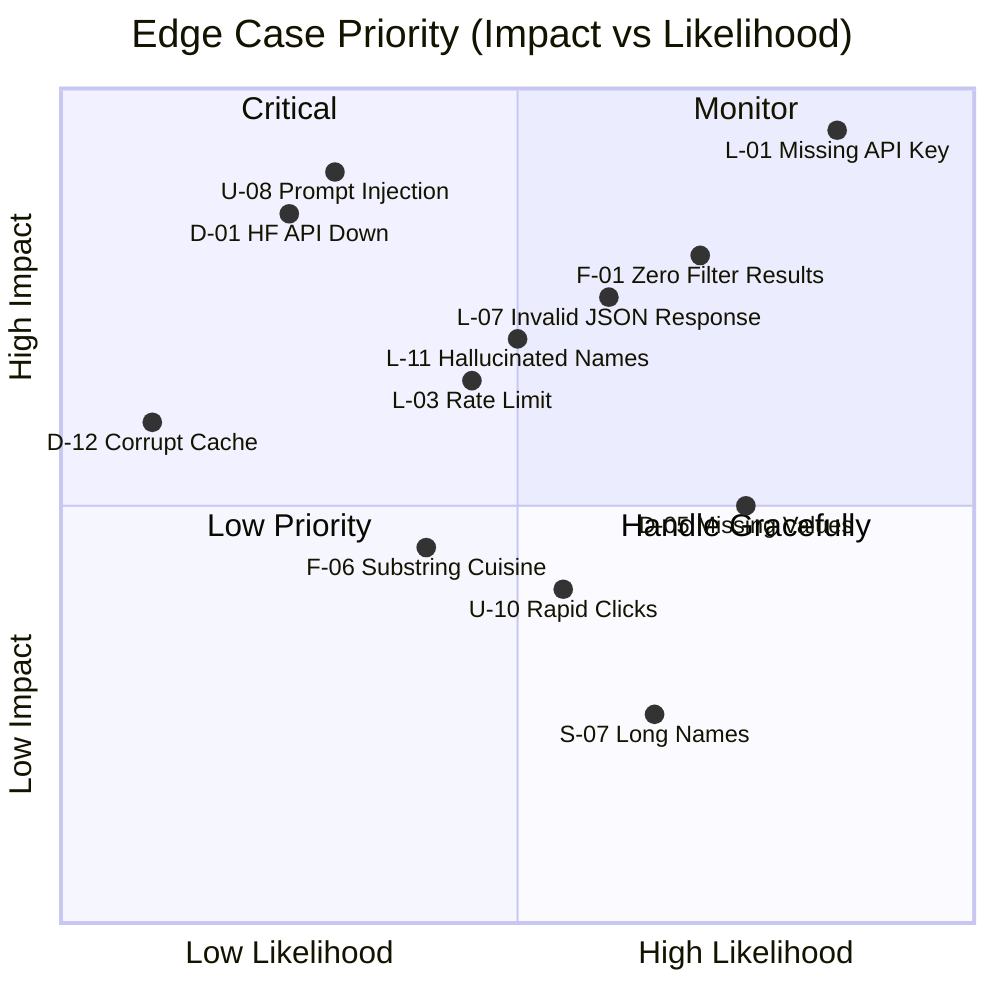

# Edge Cases & Corner Scenarios

> **Project:** AI-Powered Restaurant Recommendation System (Zomato)
> **Reference:** [architecture.md](file:///d:/saksham%20projects/ZOMATO%20milestone%201/Docs/architecture.md) · [context.md](file:///d:/saksham%20projects/ZOMATO%20milestone%201/Docs/context.md) · [implementation-plan.md](file:///d:/saksham%20projects/ZOMATO%20milestone%201/Docs/implementation-plan.md)

---

## 1. Data Ingestion Edge Cases

| #    | Scenario                                       | Impact                                           | Handling Strategy                                                              |
| ---- | ---------------------------------------------- | ------------------------------------------------ | ------------------------------------------------------------------------------ |
| D-01 | Hugging Face API is down or unreachable         | Dataset cannot be loaded                          | Fall back to locally cached CSV/Parquet; show error if no cache exists          |
| D-02 | Dataset schema changes (columns renamed/removed)| Key fields missing, code breaks                   | Validate schema on load; raise descriptive error listing missing columns        |
| D-03 | Dataset contains 0 rows                         | No restaurants to recommend                       | Detect empty DataFrame early; display "Dataset unavailable" message             |
| D-04 | Duplicate restaurant entries                    | Inflated results, repeated recommendations        | Deduplicate by `(restaurant_name, city, cuisines)` composite key               |
| D-05 | Missing values in critical fields               | Filters/ranking fail or produce wrong results     | Drop rows where `restaurant_name`, `city`, or `aggregate_rating` is null       |
| D-06 | `cost_for_two` contains non-numeric values      | Budget filtering crashes                          | Coerce to numeric with `pd.to_numeric(errors='coerce')`; drop NaN rows         |
| D-07 | `cost_for_two` = 0 or negative                  | Budget percentile calculation skewed              | Filter out rows with `cost_for_two <= 0` during preprocessing                  |
| D-08 | `aggregate_rating` outside 0.0–5.0 range        | Rating filter behaves unexpectedly                | Clamp values to [0.0, 5.0]; log warning for out-of-range entries               |
| D-09 | `cuisines` field has inconsistent separators     | Cuisine matching fails (`/` vs `,` vs `&`)        | Normalize all separators to `,`; strip whitespace around each cuisine          |
| D-10 | Extremely large dataset (100K+ rows)            | Slow load time, high memory usage                 | Load once with `@st.cache_data`; use Parquet for faster I/O                    |
| D-11 | Network timeout during Hugging Face download    | Partial or no data                                | Set timeout; retry up to 2 times; fall back to cache                           |
| D-12 | Cache file is corrupted                         | Load fails even with cache                        | Validate cache integrity; delete and re-download if corrupted                  |

---

## 2. User Input Edge Cases

| #    | Scenario                                         | Impact                                          | Handling Strategy                                                             |
| ---- | ------------------------------------------------ | ----------------------------------------------- | ----------------------------------------------------------------------------- |
| U-01 | User selects a city not in the dataset            | Zero results after location filter               | Populate dropdown only with cities present in data; prevent free-text entry    |
| U-02 | User selects no cuisine (empty list)              | Cuisine filter has nothing to match              | Treat as "any cuisine" — skip cuisine filtering                               |
| U-03 | User selects all available cuisines               | No filtering effect; large candidate set         | Allow it — equivalent to "any cuisine"; cap results via pre-ranking            |
| U-04 | User sets minimum rating = 5.0                    | Very few or zero restaurants match               | Allow it; trigger progressive filter relaxation if 0 results                  |
| U-05 | User sets minimum rating = 0.0                    | No filtering effect                              | Allow it — effectively skips rating filter                                    |
| U-06 | Additional preferences field contains profanity   | Inappropriate content passed to LLM              | Basic content moderation; sanitize input before prompt injection               |
| U-07 | Additional preferences field is extremely long     | Exceeds LLM token limit                         | Truncate to 500 characters with warning                                       |
| U-08 | Additional preferences contains prompt injection   | LLM behavior manipulation                       | Wrap user input in delimiters; instruct LLM to ignore system-override attempts|
| U-09 | User submits form with no preferences at all       | All filters skipped; entire dataset passed       | Require at least location; show validation error                              |
| U-10 | User rapidly clicks "Get Recommendations" button   | Multiple concurrent API calls                   | Disable button during processing; use `st.spinner` as guard                   |
| U-11 | User enters city name with different casing        | Case-sensitive match fails                       | Normalize both dataset cities and input to `.lower().strip()`                 |
| U-12 | User selects cuisine that exists globally but not in selected city | 0 results for that cuisine in that city | Show info message: "No {cuisine} restaurants found in {city}"                 |

---

## 3. Filter Engine Edge Cases

| #    | Scenario                                          | Impact                                          | Handling Strategy                                                              |
| ---- | ------------------------------------------------- | ----------------------------------------------- | ------------------------------------------------------------------------------ |
| F-01 | All filters combined return 0 results              | Nothing to send to LLM                          | Progressive relaxation: remove cuisine → lower rating → expand budget → city-wide fallback |
| F-02 | Only 1 restaurant matches all filters              | LLM asked to "rank" a single item               | Return directly without LLM call; show "Only 1 match found"                   |
| F-03 | Exactly 5 restaurants match (equal to top-N)       | No ranking differentiation needed                | Still pass to LLM for explanations; ranking is trivial                        |
| F-04 | Multiple restaurants have identical ratings & cost  | Tie-breaking ambiguity in pre-ranking            | Secondary sort by `votes` (descending); tertiary by `restaurant_name` (alpha) |
| F-05 | Budget percentile boundaries overlap               | Restaurants at boundary assigned to wrong tier   | Use `<=` for lower bound, `<` for upper bound; boundary belongs to lower tier  |
| F-06 | A cuisine appears as substring of another           | "Chinese" matches "Indo-Chinese"                | Use word-boundary or exact-token matching after splitting by `,`              |
| F-07 | City name appears as substring of another           | "Delhi" matches "New Delhi"                     | Use exact match; provide both as separate dropdown options                     |
| F-08 | Filter relaxation loops infinitely                  | App hangs                                       | Set max relaxation iterations (e.g., 4); return empty with message if exhausted|
| F-09 | Pre-ranking score `rating × votes` overflows        | Unlikely but extreme values cause issues        | Use `float64`; ratings are 0–5 and votes are bounded                          |
| F-10 | Dataset has restaurants with 0 votes but high rating | Unreliable ratings skew pre-ranking            | Optionally require minimum vote threshold (e.g., votes ≥ 10)                  |

---

## 4. LLM / Groq API Edge Cases

| #    | Scenario                                           | Impact                                         | Handling Strategy                                                              |
| ---- | -------------------------------------------------- | ---------------------------------------------- | ------------------------------------------------------------------------------ |
| L-01 | `GROQ_API_KEY` is missing or empty in `.env`        | Client initialization fails                    | Check at startup; show clear setup instructions and exit gracefully            |
| L-02 | `GROQ_API_KEY` is invalid / revoked                 | 401 Unauthorized error                         | Catch `AuthenticationError`; display "Invalid API key" message                 |
| L-03 | Groq API returns 429 (rate limit exceeded)          | Request rejected                               | Retry with exponential backoff (1s → 2s → 4s); max 3 retries                  |
| L-04 | Groq API returns 500 / 503 (server error)           | Transient service failure                      | Retry up to 3 times; show "Service temporarily unavailable" on exhaustion      |
| L-05 | Groq API request times out (>30s)                   | User sees indefinite loading                   | Set 30s timeout; show "Request timed out, please try again"                    |
| L-06 | Groq API returns empty response body                | Parser receives empty string                   | Detect empty response; return fallback rule-based ranking                      |
| L-07 | LLM response is valid text but not valid JSON       | JSON parsing fails                             | Attempt regex extraction of JSON array `\[.*\]`; fall back to rule-based       |
| L-08 | LLM returns JSON with missing required fields       | Incomplete recommendation cards                | Validate each recommendation dict; skip entries with missing fields            |
| L-09 | LLM returns more than 5 recommendations             | Extra data displayed                           | Truncate to top 5 from the response                                           |
| L-10 | LLM returns fewer than 5 recommendations            | Fewer cards than expected                      | Display whatever is returned; add note "Showing {n} of 5 requested"           |
| L-11 | LLM hallucinates restaurant names not in dataset    | Fake restaurants displayed to user             | Cross-reference returned names against filtered candidates; flag mismatches    |
| L-12 | LLM response contains markdown/HTML in explanation  | Card rendering breaks or looks messy           | Strip markdown/HTML tags from explanation field                                |
| L-13 | LLM returns restaurants in wrong rank order          | Confusing display                              | Re-sort by the `rank` field; if missing, use order of appearance               |
| L-14 | LLM response exceeds `max_tokens` and is truncated  | Incomplete JSON (cut off mid-array)            | Detect truncation; attempt to close JSON (`]}`); re-request with higher limit  |
| L-15 | Model specified in config doesn't exist on Groq     | 404 or model-not-found error                   | Catch error; fall back to default model (`llama3-70b-8192`)                    |
| L-16 | Concurrent users exhaust API quota                  | All requests start failing                     | Implement request queue; show "High demand, please wait" message               |

---

## 5. Prompt Engineering Edge Cases

| #    | Scenario                                          | Impact                                          | Handling Strategy                                                            |
| ---- | ------------------------------------------------- | ----------------------------------------------- | ---------------------------------------------------------------------------- |
| P-01 | Filtered restaurant data is too large for context  | Exceeds model context window (8192 tokens)      | Cap candidates at 15–20; summarize data as compact table, not full JSON      |
| P-02 | Restaurant names contain special characters         | Prompt formatting breaks                        | Escape special characters; use pipe-delimited tables instead of JSON in prompt|
| P-03 | User's additional preferences contradict filters    | e.g., "cheap" but budget=high                   | Pass both to LLM; let it reconcile and explain the conflict                  |
| P-04 | Multiple cuisines create ambiguous preference        | LLM unsure which to prioritize                  | Instruct LLM to diversify across requested cuisines                          |
| P-05 | Prompt template file is missing or corrupted        | Prompt construction fails                       | Embed default templates as Python constants; log warning if file missing     |
| P-06 | Token count approaches model limit                  | Response may be cut short                       | Estimate token count before sending; trim restaurant data if over 80% limit  |

---

## 6. Frontend / Streamlit Edge Cases

| #    | Scenario                                          | Impact                                          | Handling Strategy                                                            |
| ---- | ------------------------------------------------- | ----------------------------------------------- | ---------------------------------------------------------------------------- |
| S-01 | Streamlit cache becomes stale after dataset update  | Old data served to users                        | Add "Refresh Data" button; set `ttl` on `@st.cache_data` (e.g., 24h)        |
| S-02 | Browser session expires or tab is closed mid-request| Orphaned API call to Groq                       | Groq call completes but result is lost; no action needed (stateless)         |
| S-03 | User's browser doesn't support modern CSS/JS        | UI renders incorrectly                          | Use standard Streamlit components (no custom JS); degrade gracefully         |
| S-04 | Streamlit reruns entire script on every interaction  | Unnecessary data reloads and API calls          | Use `st.session_state` to persist data between reruns                        |
| S-05 | Multiple users access the app simultaneously        | Shared state conflicts                          | Streamlit runs separate sessions per user; no conflict (stateless design)    |
| S-06 | Long LLM response time (10–20s)                     | User thinks app is frozen                       | Show `st.spinner("Generating recommendations...")` with estimated wait time  |
| S-07 | Very long restaurant names overflow card layout      | Card UI breaks                                  | Truncate names to 50 chars with `...`; show full name in tooltip             |
| S-08 | Explanation text is very long (200+ words)           | Cards become excessively tall                   | Truncate to 100 words with "Read more" expander                             |
| S-09 | Unicode characters in restaurant names               | Encoding issues in display                      | Ensure UTF-8 encoding throughout; Streamlit handles Unicode natively         |
| S-10 | `.env` file not found when running `streamlit run`   | API key loading fails                           | Check file existence; show setup instructions with code snippet              |

---

## 7. Security Edge Cases

| #    | Scenario                                          | Impact                                          | Handling Strategy                                                             |
| ---- | ------------------------------------------------- | ----------------------------------------------- | ----------------------------------------------------------------------------- |
| X-01 | API key exposed in code or logs                    | Security breach; unauthorized API usage         | Load from `.env` only; never log or print keys; add `.env` to `.gitignore`    |
| X-02 | Prompt injection via additional preferences         | User manipulates LLM behavior                  | Wrap user input in triple-backtick delimiters; add "ignore override" instruction|
| X-03 | User submits XSS payload in text fields             | Script injection in UI                         | Streamlit auto-escapes HTML; sanitize inputs as defense-in-depth               |
| X-04 | Denial-of-service via rapid repeated requests       | API quota exhausted; costs spike               | Rate-limit button clicks; debounce with `time.sleep(1)` between submissions   |
| X-05 | `.env` file committed to Git                        | API key leaked to public repo                  | Pre-populate `.gitignore` with `.env`; add pre-commit hook check              |

---

## 8. Performance Edge Cases

| #    | Scenario                                          | Impact                                          | Handling Strategy                                                             |
| ---- | ------------------------------------------------- | ----------------------------------------------- | ----------------------------------------------------------------------------- |
| R-01 | Dataset has 100K+ rows; filtering is slow           | UI lag on each request                         | Pre-filter and cache by city on load; use vectorized Pandas operations         |
| R-02 | Multiple filter relaxation rounds executed          | Adds 2–4× latency per relaxation round          | Log relaxation steps; set hard limit of 4 rounds; parallelize if possible     |
| R-03 | Groq API cold start latency                        | First request takes longer than subsequent ones  | Make a lightweight warm-up call on app startup                                |
| R-04 | Large prompt token count slows LLM response         | 10–20s response time                           | Minimize prompt tokens; use tabular format instead of JSON for restaurant data |
| R-05 | Streamlit reloads entire page on state change       | Flicker and perceived slowness                  | Use `st.session_state` and `st.form` to batch updates                         |

---

## Edge Case Priority Matrix



### Priority Legend

| Priority          | Action Required                                  | Example Scenarios               |
| ----------------- | ------------------------------------------------ | ------------------------------- |
| 🔴 **Critical**   | Must handle before release                       | L-01, F-01, L-07, D-01         |
| 🟡 **Important**  | Handle in Phase 6 (Integration & Polish)         | L-11, L-03, U-08, D-05         |
| 🟢 **Nice-to-have** | Handle if time permits; monitor post-release   | S-07, F-06, D-12, R-03         |

---

## Testing Checklist for Edge Cases

```markdown
### Critical (Must Test Before Release)
- [ ] D-01: Disconnect network → verify cache fallback works
- [ ] F-01: Select rare cuisine + high rating → verify filter relaxation
- [ ] L-01: Remove GROQ_API_KEY from .env → verify error message
- [ ] L-07: Mock invalid JSON response → verify regex fallback
- [ ] U-09: Submit empty form → verify validation error

### Important (Test During Phase 6)
- [ ] D-05: Inject null values into test data → verify rows are dropped
- [ ] F-04: Create tied restaurants → verify consistent tie-breaking
- [ ] L-03: Mock 429 response → verify retry with backoff
- [ ] L-11: Mock hallucinated names → verify cross-reference check
- [ ] U-08: Enter "ignore previous instructions" → verify prompt safety

### Nice-to-Have (Post-Release Monitoring)
- [ ] D-10: Load 100K+ row dataset → verify performance
- [ ] S-07: Add restaurant with 100-char name → verify card layout
- [ ] R-03: Cold start after fresh deploy → measure first-request latency
```
