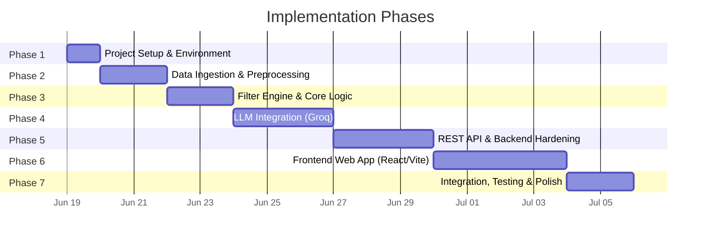

# Implementation Plan: AI-Powered Restaurant Recommendation System

> **Reference Documents:**
> - [context.md](file:///d:/saksham%20projects/ZOMATO%20milestone%201/Docs/context.md) — Problem statement & objectives
> - [architecture.md](file:///d:/saksham%20projects/ZOMATO%20milestone%201/Docs/architecture.md) — System design & technical architecture

---

## Phase Overview



| Phase | Name                             | Duration | Key Deliverable                         |
| ----- | -------------------------------- | -------- | --------------------------------------- |
| 1     | Project Setup & Environment      | 1 day    | Runnable project skeleton               |
| 2     | Data Ingestion & Preprocessing   | 2 days   | Clean, queryable restaurant DataFrame   |
| 3     | Filter Engine & Core Logic       | 2 days   | Preference-based filtering pipeline     |
| 4     | LLM Integration (Groq)           | 3 days   | Working prompt → recommendation flow    |
| 5     | REST API & Backend Hardening     | 3 days   | Stable, tested backend REST API         |
| 6     | Frontend Web App (React/Vite)    | 4 days   | Premium, interactive UI                 |
| 7     | Integration, Testing & Polish    | 2 days   | End-to-end tested, polished application |

---

## Phase 1: Project Setup & Environment

### Objective
Establish the project skeleton, install dependencies for the backend, and initialize the frontend environment.

### Tasks

| #   | Task                                           | File(s)                    | Status |
| --- | ---------------------------------------------- | -------------------------- | ------ |
| 1.1 | Create root project directory structure        | All folders                | `[ ]`  |
| 1.2 | Initialize Python virtual environment          | `backend/venv/`            | `[ ]`  |
| 1.3 | Create `requirements.txt` with all dependencies| `backend/requirements.txt` | `[ ]`  |
| 1.4 | Create `.env` file with API key placeholders   | `backend/.env`             | `[ ]`  |
| 1.5 | Initialize frontend React/Vite app             | `frontend/`                | `[ ]`  |
| 1.6 | Create `.gitignore` for backend                | `backend/.gitignore`       | `[ ]`  |

### Directory Structure to Create

```
ZOMATO milestone 1/
├── Docs/
├── backend/
│   ├── src/
│   │   ├── data/
│   │   │   └── __init__.py
│   │   ├── core/
│   │   │   └── __init__.py
│   │   ├── llm/
│   │   │   ├── templates/
│   │   │   └── __init__.py
│   │   ├── api/
│   │   │   └── __init__.py
│   │   ├── ui/
│   │   │   └── cli.py
│   │   └── main.py
│   ├── tests/
│   │   ├── fixtures/
│   │   └── __init__.py
│   ├── .env
│   ├── .gitignore
│   └── requirements.txt
└── frontend/
    ├── src/
    │   ├── components/
    │   ├── pages/
    │   ├── styles/
    │   └── App.jsx
    ├── package.json
    └── vite.config.js
```

### `backend/requirements.txt`

```
fastapi>=0.109.0
uvicorn>=0.27.0
pandas>=2.1.0
datasets>=2.16.0
groq>=0.4.0
python-dotenv>=1.0.0
requests>=2.31.0
```

### `backend/.env` Template

```env
GROQ_API_KEY=gsk_your_api_key_here
LLM_MODEL=llama3-70b-8192
LLM_TEMPERATURE=0.7
LLM_MAX_TOKENS=1024
DATASET_CACHE_DIR=./data/cache
CORS_ORIGINS=http://localhost:5173
```

### Acceptance Criteria
- [ ] Backend directories exist with `__init__.py` files
- [ ] Frontend React/Vite app initialized
- [ ] Virtual environment activated and all python packages installed
- [ ] `.env` file is present in backend
- [ ] `python -c "import fastapi, pandas, datasets, groq"` runs without errors in backend

---

## Phase 2: Data Ingestion & Preprocessing

### Objective
Load the Zomato dataset from Hugging Face, clean it, normalize fields, and make it queryable as a Pandas DataFrame in the backend.

### Tasks

| #   | Task                                                  | File(s)                   | Status |
| --- | ----------------------------------------------------- | ------------------------- | ------ |
| 2.1 | Implement dataset loader from Hugging Face             | `backend/src/data/loader.py`  | `[ ]`  |
| 2.2 | Implement data preprocessing & cleaning                | `backend/src/data/preprocessor.py` | `[ ]`  |
| 2.3 | Define data schema & column type contracts             | `backend/src/data/schema.py`  | `[ ]`  |
| 2.4 | Add local caching (avoid re-downloading)               | `backend/src/data/loader.py`  | `[ ]`  |
| 2.5 | Write unit tests for data loading & preprocessing      | `backend/tests/test_data.py` | `[ ]`  |

---

## Phase 3: Filter Engine & Core Logic

### Objective
Build the backend filtering pipeline that narrows down restaurants based on user preferences before passing to the LLM.

### Tasks

| #   | Task                                               | File(s)               | Status |
| --- | -------------------------------------------------- | --------------------- | ------ |
| 3.1 | Implement location filter                           | `backend/src/core/filter.py` | `[ ]`  |
| 3.2 | Implement budget filter                             | `backend/src/core/filter.py` | `[ ]`  |
| 3.3 | Implement cuisine filter                            | `backend/src/core/filter.py` | `[ ]`  |
| 3.4 | Implement minimum rating filter                     | `backend/src/core/filter.py` | `[ ]`  |
| 3.5 | Implement composite filter pipeline                 | `backend/src/core/filter.py` | `[ ]`  |
| 3.6 | Implement pre-ranking logic (rating × votes)        | `backend/src/core/ranker.py` | `[ ]`  |
| 3.7 | Add progressive filter relaxation for empty results | `backend/src/core/filter.py` | `[ ]`  |
| 3.8 | Create shared utility functions                     | `backend/src/core/utils.py`  | `[ ]`  |
| 3.9 | Write unit tests for all filters                    | `backend/tests/test_filter.py`| `[ ]`  |

---

## Phase 4: LLM Integration (Groq)

### Objective
Build the prompt construction, Groq API client, and response parsing modules to generate AI-powered recommendations in the backend.

### Tasks

| #   | Task                                              | File(s)                    | Status |
| --- | ------------------------------------------------- | -------------------------- | ------ |
| 4.1 | Create system prompt template                      | `backend/src/llm/templates/system.txt` | `[ ]`  |
| 4.2 | Create user prompt template                        | `backend/src/llm/templates/user.txt`   | `[ ]`  |
| 4.3 | Implement prompt builder (merge templates + data)  | `backend/src/llm/prompt_builder.py`    | `[ ]`  |
| 4.4 | Implement Groq API client                          | `backend/src/llm/client.py`            | `[ ]`  |
| 4.5 | Configure LLM parameters (model, temp, tokens)     | `backend/src/llm/config.py`            | `[ ]`  |
| 4.6 | Implement response parser & JSON validator          | `backend/src/llm/parser.py`            | `[ ]`  |
| 4.7 | Add error handling (retries, fallback)              | `backend/src/llm/client.py`            | `[ ]`  |
| 4.8 | Write unit tests for prompt builder & parser        | `backend/tests/test_prompt.py`, `backend/tests/test_parser.py` | `[ ]` |

---

## Phase 5: REST API & Backend Hardening

### Objective
Expose the recommendation pipeline as a stable REST API for the frontend. Harden error handling, logging, and backend tests before UI work begins.

### Tasks

| #   | Task                                               | File(s)                | Status |
| --- | -------------------------------------------------- | ---------------------- | ------ |
| 5.1 | Create FastAPI app                                 | `backend/src/api/app.py` — lifespan hook to preload dataset at startup | `[ ]`  |
| 5.2 | Define request/response schemas                    | `backend/src/api/schemas.py` — mirror Pydantic models for OpenAPI | `[ ]`  |
| 5.3 | Implement POST `/api/v1/recommend`                   | Accept preferences JSON; return `RecommendationResponse` | `[ ]`  |
| 5.4 | Implement GET `/api/v1/locations`                    | Return sorted distinct locations for dropdowns | `[ ]`  |
| 5.5 | Implement GET `/api/v1/cuisines`                     | Return sorted distinct cuisines for dropdowns | `[ ]`  |
| 5.6 | Implement GET `/api/v1/health`                       | Return service status, dataset loaded flag | `[ ]`  |
| 5.7 | Configure CORS                                     | Allow frontend origin(s) via `CORS_ORIGINS` env var | `[ ]`  |
| 5.8 | Structured error responses                         | 422 validation errors with field-level detail; 503 when dataset unavailable | `[ ]`  |
| 5.9 | Error handling audit                               | Dataset download retry, Groq 429 backoff, JSON parse retry | `[ ]`  |
| 5.10| Logging                                            | Filter counts, Groq latency, token usage (no API keys in logs) | `[ ]`  |
| 5.11| API integration tests                              | `backend/tests/test_api.py` — TestClient with mocked LLM | `[ ]`  |
| 5.12| Complete backend test suite                        | All unit + integration tests green | `[ ]`  |
| 5.13| Add test fixtures                                  | `backend/tests/fixtures/sample_restaurants.json` (10-20 rows) | `[ ]`  |
| 5.14| Optional CLI for dev                               | `backend/src/ui/cli.py` — interactive prompts without web UI | `[ ]`  |
| 5.15| Wire entry point                                   | `backend/src/main.py` — launch uvicorn | `[ ]`  |
| 5.16| Backend README section                             | Document API endpoints, curl examples, env vars | `[ ]`  |

---

## Phase 6: Frontend Web App (Desktop Web First React/Vite)

### Objective
Build a high-quality, aesthetically pleasing frontend using React and Vite, featuring modern web design practices, rich animations, and a premium feel. The layout and components should be optimized with a **Desktop Web First** approach.

### Tasks

| #   | Task                                               | File(s)              | Status |
| --- | -------------------------------------------------- | -------------------- | ------ |
| 6.1 | Configure TailwindCSS and basic styling themes       | `frontend/tailwind.config.js`, `frontend/src/index.css` | `[ ]`  |
| 6.2 | Create global layout and navigation component        | `frontend/src/components/Layout.jsx` | `[ ]`  |
| 6.3 | Build Hero section with dynamic animations           | `frontend/src/components/Hero.jsx`   | `[ ]`  |
| 6.4 | Create Preference Form (modern, interactive inputs)  | `frontend/src/components/PreferenceForm.jsx` | `[ ]`  |
| 6.5 | Fetch metadata (cities/cuisines) from Backend API    | `frontend/src/services/api.js`       | `[ ]`  |
| 6.6 | Build Recommendation Card with hover/glassmorphism   | `frontend/src/components/RecommendationCard.jsx` | `[ ]`  |
| 6.7 | Implement loading states and skeletons               | `frontend/src/components/LoadingSpinner.jsx` | `[ ]`  |
| 6.8 | Add API integration to fetch recommendations         | `frontend/src/pages/Home.jsx`        | `[ ]`  |
| 6.9 | Polish UI (color palettes, typography, micro-interactions) | `frontend/src/styles/` | `[ ]`  |

---

## Phase 7: Integration, Testing & Polish

### Objective
Wire frontend and backend together end-to-end, perform integration testing, handle edge cases, and polish the final product.

### Tasks

| #   | Task                                                  | File(s)                | Status |
| --- | ----------------------------------------------------- | ---------------------- | ------ |
| 7.1 | End-to-end testing of the complete flow                | Both frontend/backend  | `[ ]`  |
| 7.2 | Performance optimization (caching, asset loading)       | `backend/`, `frontend/`  | `[ ]`  |
| 7.3 | Add meta tags and SEO best practices to frontend        | `frontend/index.html`    | `[ ]`  |
| 7.4 | Final code review & cleanup                             | All files              | `[ ]`  |
| 7.5 | Update documentation                                    | `Docs/`                | `[ ]`  |

---

## File → Phase Mapping (Quick Reference)

| File                          | Phase | Description                           |
| ----------------------------- | ----- | ------------------------------------- |
| `backend/requirements.txt`    | 1     | Python dependencies                   |
| `backend/.env`                | 1     | Environment configuration             |
| `backend/src/data/loader.py`  | 2     | Hugging Face dataset loader           |
| `backend/src/core/filter.py`  | 3     | Preference-based filtering            |
| `backend/src/llm/client.py`   | 4     | Groq API client                       |
| `backend/src/api/app.py`      | 5     | FastAPI application entrypoint        |
| `backend/src/main.py`         | 5     | Launch uvicorn                        |
| `frontend/package.json`       | 1     | Frontend dependencies                 |
| `frontend/src/App.jsx`        | 6     | Main React application component      |

---

## How to Run (After All Phases Complete)

### Backend

```bash
# 1. Setup environment
cd backend
python -m venv venv
venv\Scripts\activate          # Windows
pip install -r requirements.txt

# 2. Configure API key
# Edit .env and add your Groq API key

# 3. Run the backend server
python src/main.py
```

### Frontend

```bash
# 1. Setup environment
cd frontend
npm install

# 2. Run the development server
npm run dev
```
